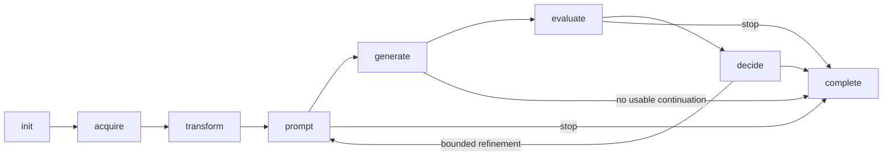

# Agentic remediation runtime

A11yResearch coordinates model-assisted diagnosis/generation with typed tools and deterministic controls. Its versioned remediation procedures are defined in `web/app/agent_skills/manifest.json` and loaded by the application at runtime.

## State machine



`AgentRuntime.move()` in `web/app/remediation_agent_runtime.py` validates the transition map and records from/to states, iteration, reason and timestamp. The complete state has no outgoing transition. Iteration limits and source identifiers are taken from the submitted run configuration.

## Versioned skills

| Skill ID | Role |
| --- | --- |
| `grounded-accessibility-diagnosis` | Interpret actual DOM/Axe/Lighthouse evidence |
| `minimal-preservation-repair` | Generate narrowly constrained changes |
| `coordinated-component-repair` | Component planning and coordinated repair |
| `html-born-accessible-regeneration` | Whole-page HTML regeneration |
| `markdown-born-accessible-regeneration` | Quality-checked Markdown regeneration |
| `adaptive-evidence-grounding` | Conditional attributed ACT evidence |
| `measured-evaluation-and-rollback` | Evaluation, preservation measurements and deterministic selection |

The catalogue validates its schema and hashes each complete skill definition and the manifest bytes. Iteration evidence includes the ID, version, digest, allowed tools and sources of every activated skill, making procedure changes identifiable across runs.

## Typed tools

In `web/app/remediation_tool_registry.py`, `ToolContract` declares a tool's name, version, description, required inputs, output type, deterministic flag and whether it mutates the candidate. `ToolRegistry.invoke()` checks registration, required inputs and output-type contracts, then records completion/failure and duration.

The registry checks tool interfaces. Individual handlers additionally validate generated HTML, selectors, permitted change scope and preservation requirements before applying operations.

```python
# docs-test: offline
from remediation_tool_registry import ToolContract, ToolRegistry

registry = ToolRegistry()
registry.register(
    ToolContract("count", "1.0", "Count supplied observations", ("items",),
                 "integer", True),
    lambda items: len(items),
)
assert registry.invoke("count", items=["a", "b"]) == 2
assert registry.records[-1]["status"] == "completed"
try:
    registry.invoke("count")
except ValueError:
    pass
else:
    raise AssertionError("Missing required input was not rejected")
```

## Candidate selection and rollback

For Axe `a`, Lighthouse `l`, configured maximum `A` and minimum `L`:

```text
Target distance = max(a − A, 0) + max(L − l, 0)
```

Missing required measurements yield an unusable distance. Candidates are ordered
first by the smallest distance, then by the highest **lowest retention percentage**
among words, links, images and banners/media. Ties use text retention, then RGB
similarity at levels 1–3. This protects the weakest content component rather than
using the report's average content-retention summary. Levels 4–5 intentionally
allow redesign, so they do not use resemblance to the original screenshot as a
tie-break. Regeneration also records native-form/content preservation evidence.

A worse iteration rolls back to the best evaluated candidate. Feedback refers to the retained page and explicitly summarizes rejected changes so the next iteration does not reason from stale rejected markup.

## Deterministic stopping and accounting

Cost, time, iteration limits, plateau and marginal-improvement rules control continuation. Usage records cover responses that subsequently fail parsing, and incomplete evaluator items retain their error details. Candidate acceptance uses the recorded measurements and configured targets.

Cost checks occur after calls and before subsequent work, so the final charge can exceed a threshold by the cost of an in-flight call. Each run keeps its selected provider and model configuration; changing that selection creates a new run.

See [evidence](../guide/evidence.md), [preservation](preservation.md) and [verification tests](../development/testing.md) for the observable contracts.
