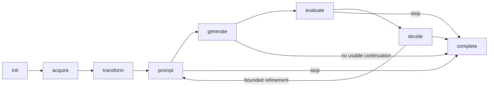

# Agentic remediation runtime

WARP coordinates model-assisted diagnosis/generation with typed tools and deterministic controls. Its versioned remediation procedures are defined in `web/app/agent_skills/manifest.json` and loaded by the application at runtime.

## State machine



`AgentRuntime.move()` validates a fixed transition map and records from/to states, iteration, reason and timestamp. The complete state has no outgoing transition. The model cannot grant itself more iterations or change a source's identity.

## Versioned skills

| Skill ID | Role |
| --- | --- |
| `grounded-accessibility-diagnosis` | Interpret actual DOM/Axe/Lighthouse evidence |
| `minimal-preservation-repair` | Generate narrowly constrained changes |
| `coordinated-component-repair` | Component planning and coordinated repair |
| `html-born-accessible-regeneration` | Whole-page HTML regeneration |
| `markdown-born-accessible-regeneration` | Quality-checked Markdown regeneration |
| `adaptive-evidence-grounding` | Conditional attributed ACT evidence |
| `measured-evaluation-and-rollback` | Evaluation, preservation measurements and deterministic selection |

The catalogue validates its schema and hashes each complete skill definition as well as the manifest bytes. Activated skills retain their ID, version, digest, allowed tools and sources in evidence. Change the version and test the behavior when changing a contract; a familiar label must not hide a different procedure.

## Typed tools

`ToolContract` declares name, version, description, required inputs, output type, deterministic flag and whether a tool mutates the candidate. `ToolRegistry.invoke()` checks registration/required inputs and supported output-type contracts, then records completion/failure and duration.

The registry is a typed application boundary, not a sandbox automatically proving every handler safe. Handlers must enforce HTML/selectors/scope/preservation validation. A model response is untrusted data.

```python
# docs-test: offline
from remediation_tool_registry import ToolContract, ToolRegistry

registry = ToolRegistry()
registry.register(
    ToolContract("count", "1.0", "Count supplied observations", ("items",),
                 "integer", True),
    lambda items: len(items),
)
assert registry.invoke("count", items=["a", "b"]) == 2
assert registry.records[-1]["status"] == "completed"
try:
    registry.invoke("count")
except ValueError:
    pass
else:
    raise AssertionError("Missing required input was not rejected")
```

## Candidate selection and rollback

For Axe `a`, Lighthouse `l`, configured maximum `A` and minimum `L`:

```text
Target distance = max(a − A, 0) + max(L − l, 0)
```

Missing required measurements yield an unusable distance. The ranking is lexicographic: distance first, then minimum retained content, then text retention, then visual similarity for steps 1–3. Regeneration is not rewarded for copying the original screenshot. The regeneration path also records native-form/content preservation information for its selection/refinement decisions.

A worse iteration rolls back to the best evaluated candidate. Feedback refers to the retained page and explicitly summarizes rejected changes so the next iteration does not reason from stale rejected markup.

## Deterministic stopping and accounting

Cost, time, iteration limits, plateau and marginal-improvement rules control continuation. Paid usage is persisted before parsing can fail. An incomplete evaluator item keeps its error. Acceptance derives from measured criteria, never a reviewer's unsupported statement.

Cost checks occur after calls and before further work at defined boundaries, so thresholds are not exact prepaid caps. Provider changes require a new explicit choice, not silent fallback.

See [evidence](../guide/evidence.md), [preservation](preservation.md) and [verification tests](../development/testing.md) for the observable contracts.
