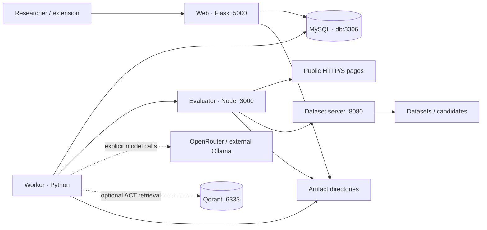

# Software architecture

WARP separates its researcher interface, persistent scheduler, browser evaluator and artifact-serving responsibilities. The model is a generator inside a bounded workflow, not the owner of the database or acceptance policy.

## Service responsibilities

| Service | Entry point | Responsibility |
| --- | --- | --- |
| `web` | `web/app/main.py` | Forms, reports, configuration, imports/exports and HTTP interfaces |
| `worker` | `web/app/worker.py` → `jobs.run_worker` | Persistent evaluation, remediation and categorization work |
| `evaluator` | `evaluator/server.js` | Controlled browser/tool execution and raw evidence |
| `dataset-server` | `dataset_server/server.py` | Serve stored HTML/candidates inside the network with resource policies |
| `db` | MySQL 8 image | Jobs, results, settings, provenance and comparisons |
| `qdrant` | Qdrant image | Optional local ACT retrieval collection |

The worker shares the web image/code but has no HTTP listener. Serving a report does not require running the evaluation within a Flask request. The current worker is a single scheduling loop, not a distributed Celery/Redis cluster.

## Network and ports

Compose defines the bridge network `accessibility_net`; Docker normally prefixes its actual name with the Compose project. `db`, `evaluator`, `dataset-server` and `qdrant` are service DNS names within that network, not stable assigned IPs.

The web host mapping is `80 → 5000`. MySQL's mapping is `3307 → 3306`: the host port and internal service port are deliberately different. The development evaluator mapping is `3000 → 3000`; the ordinary Compose file does not publish it. Dataset-server and Qdrant have no published host port in these files.

## Persistent storage

`mysql_data` and `qdrant_data` are Docker **named volumes**. `/results`, `/data` and `/datasets` are **container mount paths** bound to repository-local directories in the supplied deployment. They are not all the same kind of storage.

Browser evidence lives under `/results/raw`; local datasets and generated candidates live under `/datasets`. MySQL records their paths and identities. Removing one without the other breaks the association; a database-only backup is incomplete.

## Research-control boundaries

The UI freezes source/model/target controls at submission. The worker validates model output, invokes typed tools, checks measurements and selects a candidate through deterministic logic. Qdrant contributes attributed examples only when retrieval is actually activated.

Axe/Lighthouse acquisition does not call a cloud LLM. WAVE is an optional evaluation service. OpenRouter and Ollama are used by remediation and the selected categorization path; neither is a mandatory seventh Compose service.

See [jobs](jobs.md), [storage](storage.md), [evaluation](evaluation.md) and [agent runtime](agent-runtime.md) for the detailed contracts.
