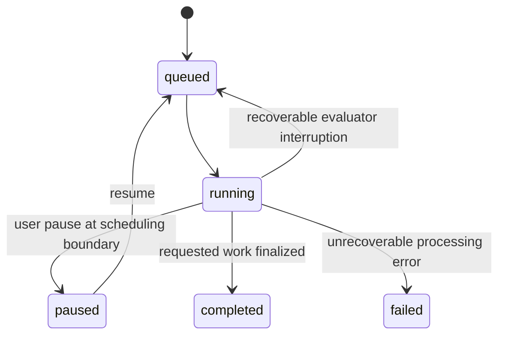

# Jobs, scheduling and recovery

The web handlers enqueue persistent records. `run_worker()` in `web/app/jobs.py`, started by `web/app/worker.py`, polls MySQL and processes them. Stored progress remains available after leaving or reloading a page.

## Scheduling order

The current single worker checks queued/running remediation runs, then queued/running evaluations, then the active URL-categorization job. Each category uses its stored creation/order information. A large or slow job can delay other work.

The supplied scheduler uses a single worker. Multiple workers sharing the same queue can process overlapping requests, so deployment uses one worker instance. [Troubleshooting](../reference/troubleshooting.md#evaluation-remains-queued) covers queued-job diagnostics.

## Evaluation states



Route handlers check the current record status before applying a requested pause, resume or recovery action.

In `web/app/jobs.py`, `pending_evaluation_urls()` identifies remaining work from the requested URL list and existing results. `store_result()` stores measurements for successful items and error details for failures. Tranco attempt and recovery metadata support retry and reserve decisions.

## Service interruption versus candidate failure

`request_evaluation()` in `web/app/jobs.py` distinguishes evaluator request failures from page-level responses. A recoverable evaluator interruption records the attempt as interrupted and can return the evaluation to queued without consuming a candidate's website retry.

Page-level failures preserve their error context. For a Tranco study, retry and replacement use stored candidate roles/reserves in the same stratum. Technical failure classification is not an accessibility-score filter.

`advance_tranco_recovery()` in `web/app/jobs.py` schedules one controlled retry per failed candidate, then deterministic same-stratum replacements. It can extend an initial reserve while unseen domains remain in the pinned interval. Once that pool is exhausted, it returns without scheduling another recovery cycle. The worker continues other work and finalizes the evaluation, retaining failed rows and an incomplete-dataset warning. The report distinguishes the processing status (`completed`) from achieved and target counts. A full-stratum request has no reserve to cover unrecoverable domains. See the [500-target / 300-success example](../guide/tranco.md#when-a-stratum-cannot-reach-its-target).

Interrupted attempts include measured timing when available. Their duration records are separate from completed-page processing totals.

## Remediation restart

Remediation evidence and events are committed during processing. The runtime can retain a previously evaluated candidate when a later provider interruption occurs under the applicable automated policy. No completed candidate means a different outcome from “completed with warnings.”

The run status, iterations and event log show the last persisted progress. A separate submission creates a new run with its own provider charges. After an abrupt process failure, these records help identify where execution stopped and which calls had already been recorded.

## Categorization

The single persisted `url_category_jobs` record stores classifier, scope, totals, progress and usage. The UI polls this record. Stop changes the status to `stopping`; the worker finishes the current safe batch and retains saved assignments.

## Operational diagnostics

```bash
docker compose ps
docker compose logs --tail=100 worker evaluator
```

Then inspect the active evaluation/run in the application. A running container alone does not establish that its current job is progressing; verify a meaningful change in committed observations or progress evidence.
