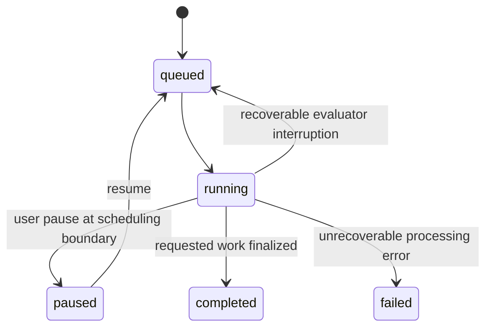

# Jobs, scheduling and recovery

The web handlers enqueue persistent records; `jobs.run_worker()` polls MySQL and performs the expensive work. Progress is not stored solely in a browser DOM or local JavaScript variable.

## Scheduling order

The current single worker checks queued/running remediation runs, then queued/running evaluations, then the active URL-categorization job. Each category uses its stored creation/order information. A large or slow job can delay other work.

Do not solve a queued job by starting a second worker against the same database. The current implementation is not documented as a multi-worker claim/lease scheduler; duplicate workers can repeat expensive operations. Diagnose the existing worker and active job first.

## Evaluation states



This is a lifecycle overview, not a claim that every transition is allowed from every UI state. The route handlers validate the existing record before applying a requested action.

`pending_evaluation_urls()` identifies remaining work from the requested URL list and existing results. `store_result()` does not persist a failed evaluator item as a normal successful result with zero counts. Tranco attempts/recovery metadata separately support retry and reserve decisions.

## Service interruption versus candidate failure

`request_evaluation()` distinguishes evaluator request failures from usable page-level responses. A recoverable evaluator interruption records the attempt as interrupted and can return the evaluation to queued without consuming a candidate as if the website itself had failed.

Page-level failures preserve their error context. For a Tranco study, retry and replacement use stored candidate roles/reserves in the same stratum. Technical failure classification is not an accessibility-score filter.

Do not invent elapsed seconds for an unrecorded interrupted attempt. Where timing is available, retain what was actually measured and label interruption separately.

## Remediation restart

Remediation evidence and events are committed during processing. The runtime can retain a previously evaluated candidate when a later provider interruption occurs under the applicable automated policy. No completed candidate means a different outcome from “completed with warnings.”

Inspect the actual run status, iteration rows and event log before resubmitting. A new request is a new experiment and can incur new provider charges. The documentation does not promise exact-once paid-call execution across every process-crash boundary.

## Categorization

The single persisted `url_category_jobs` record stores classifier, scope, totals, progress and usage. The UI polls this record. Stop changes the status to `stopping`; the worker finishes the current safe batch and retains saved assignments.

## Operational diagnostics

```bash
docker compose -f docker-compose-dev.yml ps
docker compose -f docker-compose-dev.yml logs --tail=100 worker evaluator
```

Then inspect the active evaluation/run in the application. A running container alone does not establish that its current job is progressing; verify a meaningful change in committed observations or progress evidence.
